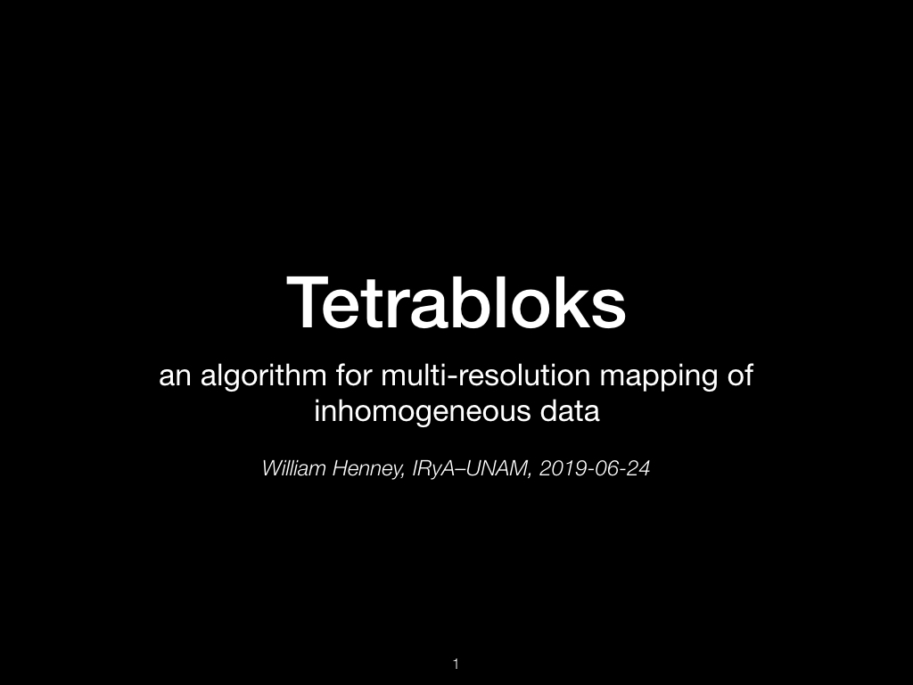
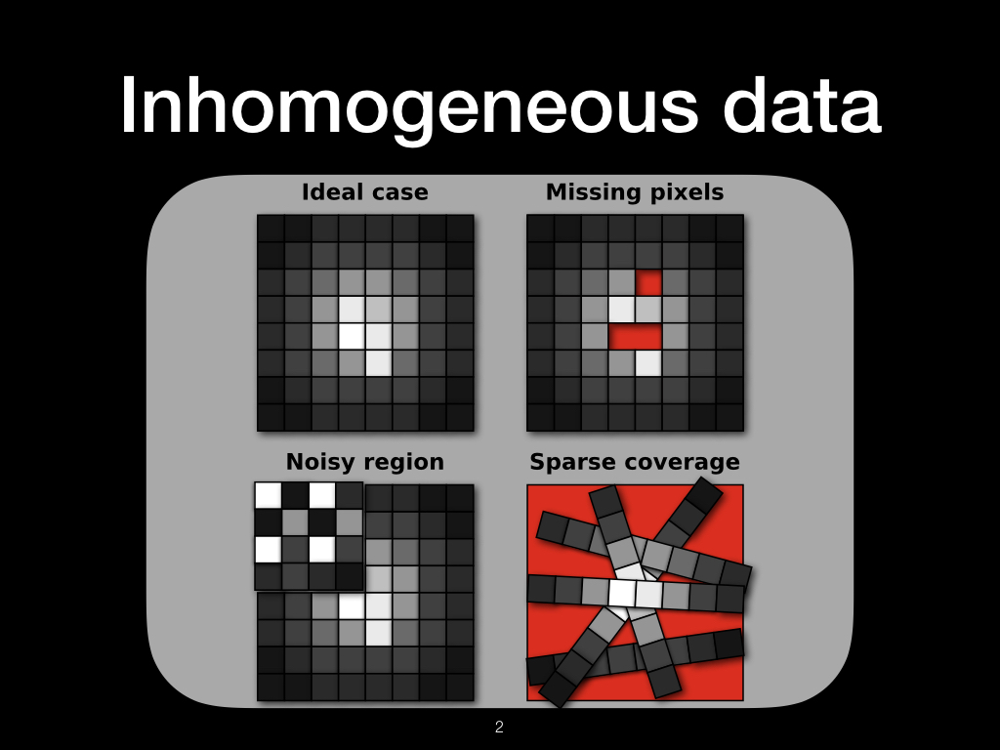
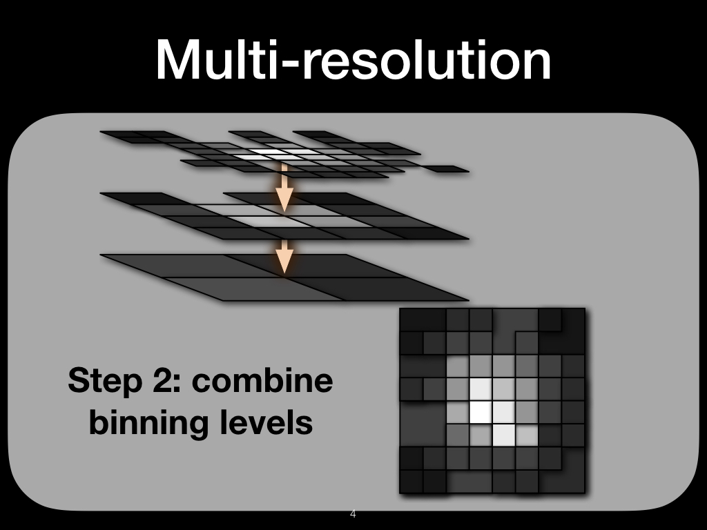
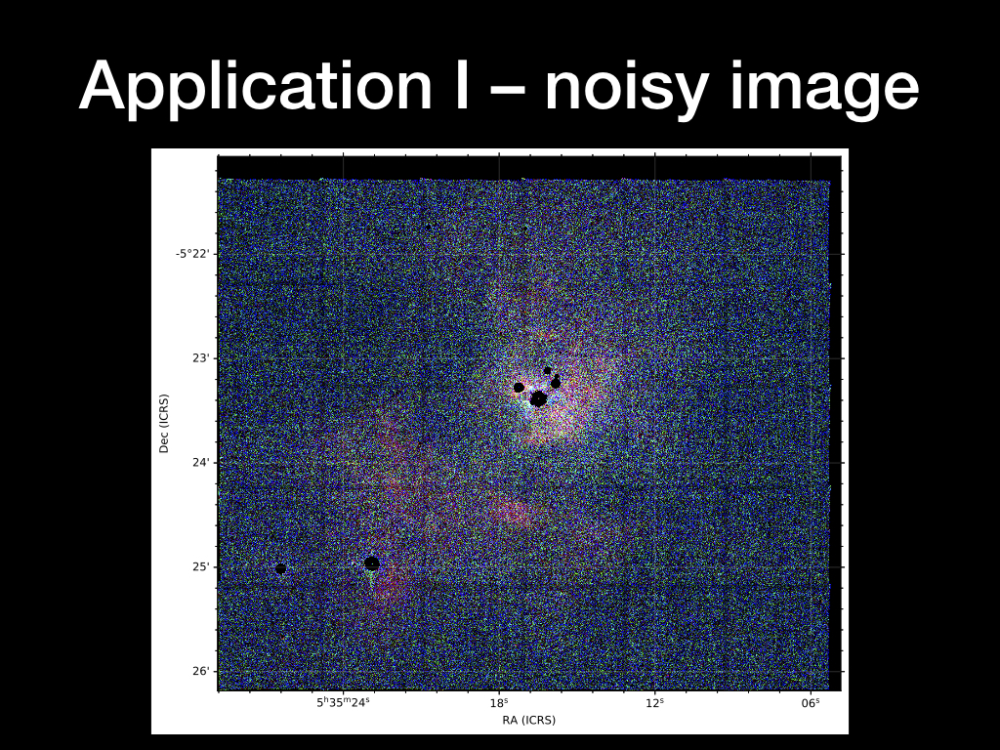
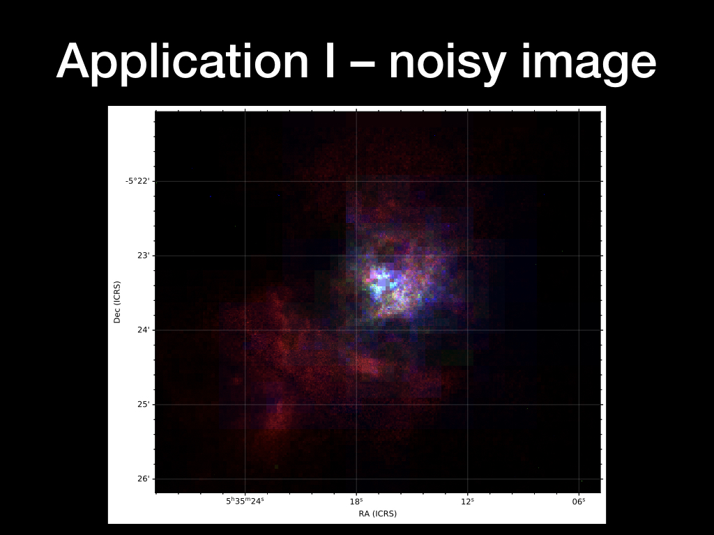

# Presentation about Tetrabloks algorithm

Will Henney - DAWGI Meeting - 2019 June 24

## Animation ##

## Individual slides ##

### Title page ###

### Inhomogeneous data ###

Different use cases for the algorithm. 

### Multi-resolution ###

### Application I - noisy image ###

