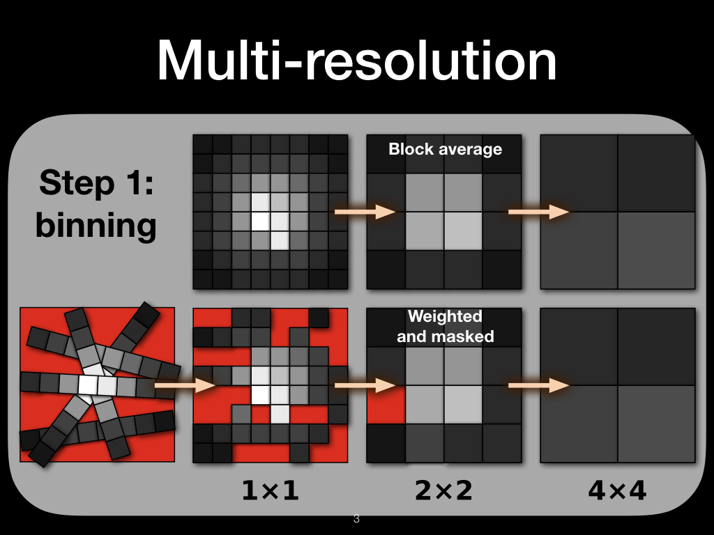

# Presentation about Tetrabloks algorithm

Will Henney - DAWGI Meeting - 2019 June 24

## Animation ##

## Individual slides ##

### Title page ###

### Inhomogeneous data ###

Tetrabloks is an algorithm for making maps of inhomogeneous data.
Different use cases for the algorithm include:

1. Missing pixels: Tetrabloks will interpolate these regions away, even if they are large
2. Noisy regions: Tetrabloks can smooth out high-noise regions while preserving the spatial resolution of low-noise regions
3. Sparse and non-uniform spatial coverage: Tetrabloks can produce maps from an arbitrary set of points. It works well for combining multiple slit positions and orientations of longslit spectroscopy. 

### Multi-resolution ###
Multi-resolution mapping proceeds via two steps. 

The first step is binning: each 2x2 block of pixels is averaged to give the next-coarser grid. Each pixel may have an associated weight, which is used in the averaging. A weight of zero indicates a missing or bad pixel (red in the figures), which does not contribute to the coarse grid. A tuneable parameter `mingood` specifies the minimum number of good pixels that a 2x2 block must have in order to create a good pixel on the coarse grid. A value of `mingood = 1` (the default) means that good regions "bleed" into bad regions, causing the bad regions to shrink. The binning is repeated to produce a sequence of coarser and coarser grids: 1x1, 2x2, 4x4, 8x8, etc.

The second step is stack the sequence of grid. In the simplest version (as illustrated), each pixel comes from the finest grid  where it has a non-zero weight. Alternatively, other criteria can be used, such as a minimum signal/noise ratio.

### Application I - noisy image ###

Before.

After.

### Application II - noisy ratio ###

Individual binning levels. 

Fixed signal-to-noise of the density.

### Application III - slit spectra ###

### Tetrapak + Megabloks = Tetrabloks ###

Inspiration for the name.

